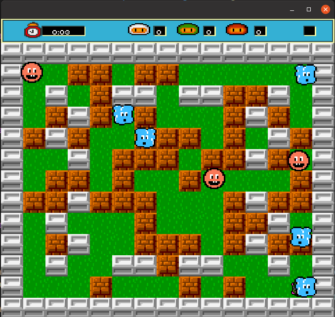

# bomberman
*PI4 - BOMBERMAN* (Linux- JDE Environment version 11)
Contributeurs : VYSHKA Tedi,   THIRUKUMAR Kieran, RODRIGUEZ Lucas,  MARTINEAU Clément
 
## Présentation 
Bomberman est une série de jeux originellement développés par Hudson Soft où vous 
incarnez un poseur de bombes qui utilise ses bombes pour se débarrasser de ses 
ennemis et se frayer un chemin jusqu’à la sortie de la carte en détruisant des obstacles. 

Les niveaux consistent en une grille à deux dimensions où le joueur et les ennemis 
peuvent se déplacer horizontalement et verticalement.

Cette grille comporte deux sortes 
d’obstacles : des obstacles indestructibles et d’autres destructibles. Les obstacles 
indestructibles sont distribués de façon uniforme : ils sont placés une ligne sur deux et 
une colonne sur deux. Les obstacles destructibles sont distribués sur la surface restante 
sans contrainte particulière. Les joueurs peuvent faire usage de leur bombe pour les 
détruire. Certains obstacles peuvent révéler des bonus lorsqu’ils sont détruits.



Le but du jeu est d’éliminer ses adversaires en usant de ses bombes et en faisant 
attention à ne pas périr sous ses propres bombes. Il faut pour cela se positionner à une 
distance supérieure à leur rayon d’action ou utiliser les obstacles pour s’abriter. Les 
bombes ont un rayon d’action qui peut être augmenté grâce à certains bonus. De même, 
la vitesse du joueur ou le nombre de bombes qu’il peut déposer peuvent être modifiés 
grâce à des bonus. Vous pourrez être créatif et laisser libre cours à votre imagination 
pour créer des bonus originaux.

Plusieurs modes de jeu existent. Il est possible de jouer contre des ennemis pilotés par 
l’ordinateur ou alors de jouer avec d’autres joueurs sur le même écran ou en ligne. Les 
ennemis contrôlés par l’ordinateur peuvent soit être des poseurs de bombes soit être de 
simples personnages ne faisant que se promener sur la grille et dont il faut éviter le 
contact. 

## Objectif 
Votre objectif est de développer un jeu inspiré de Bomberman. 
N’hésitez pas à faire preuve d’originalité en ce qui concerne les bonus et les modes de jeu 
mais il faut que cela reste réalisable dans le temps imparti. Vous avez la liberté de 
développer les modes de jeu que vous préférez. 
Il est recommandé d’utiliser les langages et technologies que vous avez vus en cours. Si 
vous souhaitez être plus original, demandez-moi au préalable.

### Construire le projet

1. cloner le répertoire
    ```
    git clone git@gaufre.informatique.univ-paris-diderot.fr:thirukum/bomberman.git
    ```
   or
    ```
    git clone https://gaufre.informatique.univ-paris-diderot.fr/thirukum/bomberman.git
    ```
2. Entrer dans le fichier du projet
    ```
    cd bomberman
    ```
3. Installer make
    ```
    sudo install make
    ```
4. Compiler le projet
    ```
    make compile
    ```

### Utiliser le logiciel
1. Exécuter le programe
    ```
    make run
    ```

## Controleur
### Joueur 1
| Command | Key |
|---------|-----|
| UP      | Z   |
| DOWN    | S   |
| LEFT    | Q   |
| RIGHT   | D   |
| BOMB    | CTRL|
### Joueur 2
| Command | Key |
|---------|-----|
| UP      | ↑   |
| DOWN    | ↓   |
| LEFT    | ←   |
| RIGHT   | →   |
| BOMB    |ALTGR|

### Joueur 3
| Command | Key |
|---------|-----|
| UP      | 8   |
| DOWN    | 5   |
| LEFT    | 4   |
| RIGHT   | 6   |
| BOMB    | 2   |

### Joueur 4
| Command | Key |
|---------|-----|
| UP      | U   |
| DOWN    | J   |
| LEFT    | H   |
| RIGHT   | K   |
| BOMB    | N   |

### System
| Command       | Key |
|---------------|-----|
| PAUSE         | ESC |


